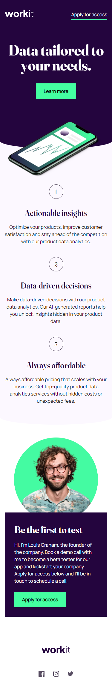

# Workit landing page solution

Workit landing page. Workit is a data curation service

Welcome to WorkIt – Your Premier Online Data Curation Platform!

At WorkIt, we believe in the power of curated data to drive informed decisions. Our platform is designed for individuals and businesses seeking a seamless solution for organizing, refining, and utilizing data effectively. Whether you're a data enthusiast, analyst, or a business professional, WorkIt empowers you to unlock the true potential of your information.

Key Features:

- Intuitive Data Curation: Effortlessly curate and clean your datasets with our user-friendly interface. Say goodbye to data clutter and hello to precision.

- Collaborative Environment: Foster collaboration with team members, allowing seamless sharing and working together on data projects in real-time.

- Smart Insights: Leverage our advanced algorithms to gain meaningful insights from your curated data. Make data-driven decisions with confidence.

- Secure and Reliable: Your data's security is our priority. Benefit from robust encryption and industry-leading security measures to ensure your information is safe.

- Scalable Solutions: Whether you're a solo user or part of a large enterprise, WorkIt scales with you. Customize your experience to fit your unique data curation needs.

- Join WorkIt today and experience the future of data curation. Unleash the potential of your data like never before!

### Screenshot

### Links

[Github repo](https://github.com/ali-akz/workit-landing-page)
[Live demo](https://ali-akz.github.io/workit-landing-page)

## My process

### Built with

- Semantic HTML
- SCSS
- [React](https://reactjs.org/) - JS library

## Author

- Website - [My portfolio](https://xpress.monster)
- GitHub - [My GitHub](https://ali-akz.github.com)
